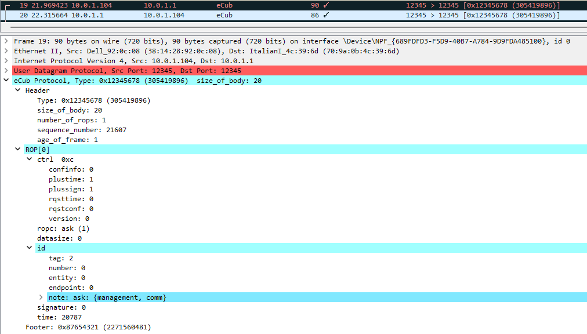

# eCub-dissector
A useful debugging tool that allows us to display clearly the UDP packed of [`The eProtocol`][1] data inside [Wireshark][2].

## Installation

You can follow the instructions described on the [official page][3]. Basically, you need only to download and copy the [`generic.dll`](http://wsgd.free.fr/download.html) for the version of Wireshark you have installed on your computer.

## How to use it

- Copy the two files `eCub_proto.fdesc` and `eCub_proto.wsgd` included in this repository to one of the following:
  - any directory if you set a environment variable : `WIRESHARK_GENERIC_DISSECTOR_DIR` = `<directory where are .fdesc_and .wsgd_files>`
  - wireshark profiles directory (e.g. `C:\Users\<user>\AppData\Roaming\Wireshark\profiles`)
  - wireshark data directory (e.g. `C:\Users\<user>\Documents`)
  - wireshark plugin directory (e.g. `C:\Program Files (x86)\Wireshark\plugins\2.6\epan`)
  - wireshark main directory (e.g. `C:\Program Files (x86)\Wireshark`)

- Run (or open) a capture `.pcapng` file with [Wireshark][2]
- If everything is good, you should see something like the following:

## References
- [Wireshark][2]
- [eProtocol][1]
- [Wsgd – wireshark Generic Dissector][4]
- [SharkFest – Wireshark dissectors][5]

[1]: https://github.com/robotology/icub-firmware/blob/master/emBODY/eBdocs/embobj/TSD-ICUBUNIT-ethernet-protocol.docx
[2]: https://www.wireshark.org/
[3]: http://wsgd.free.fr/installation.html
[4]: http://wsgd.free.fr/index.html
[5]: https://view.officeapps.live.com/op/view.aspx?src=https%3A%2F%2Fsharkfestus.wireshark.org%2Fassets%2Fpresentations%2FA1%2520Dissectors.pptx&wdOrigin=BROWSELINK
